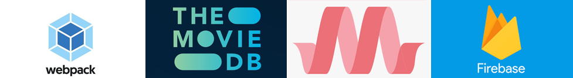

# Movie Buddies Project

## Sladkie Pirozhochki Team

### API Unit

   :sunglasses: [Alex](https://github.com/AlexBelozertsev)
   
   :smirk: [Tetiana](https://github.com/TetLaVic)

### Design Unit

   :stuck_out_tongue_winking_eye: [Yaroslav](https://github.com/arestus)
   
   :wink: [Anna](https://github.com/Anna-Sokolova)
   
   :relaxed: [Julia](https://github.com/julia22-lav)
   
   :kissing_heart: [Irina](https://github.com/Irina-Blazhevich)

### Firebase Unit

   :fishing_pole_and_fish: [Dima](https://github.com/kramskiy-dima)
   
   :see_no_evil: [Larisa](https://github.com/Larisa-Antsifrova)

## Tools & Resources

- [Webpack v4](https://v4.webpack.js.org/)
- [The MovieDB API](https://developers.themoviedb.org/3/getting-started/introduction)
- [Materialize-CSS](https://materializecss.com/)
- [Firebase Auth](https://firebase.google.com/docs/auth)
- [Firebase Firestore](https://firebase.google.com/docs/firestore)
- [Axios](https://github.com/axios/axios)
- [Lodash](https://lodash.com/)
